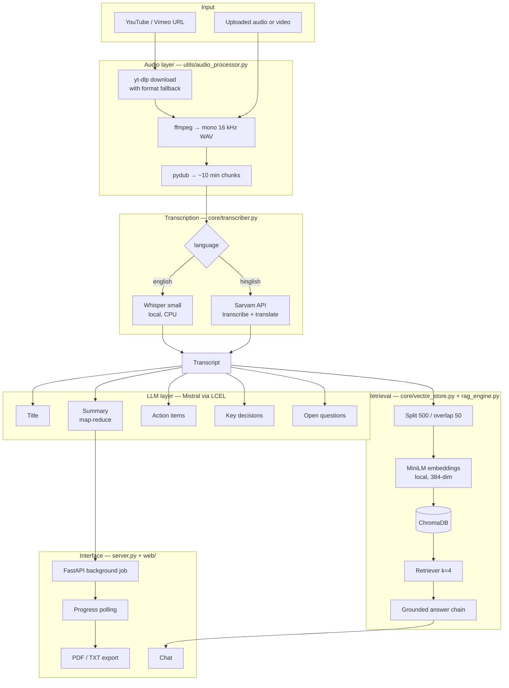
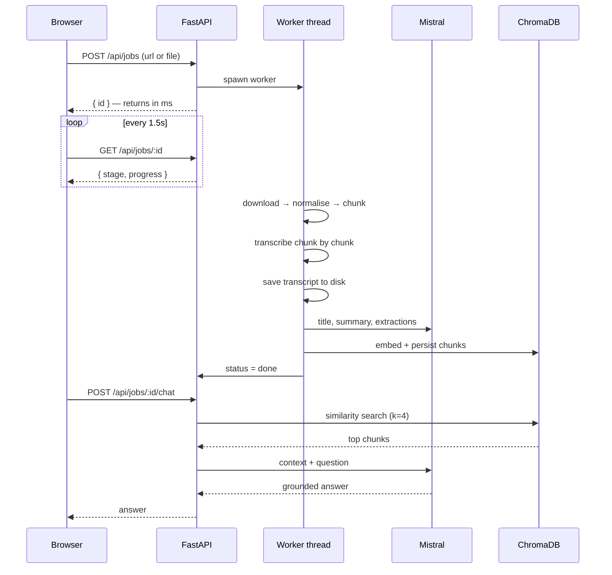
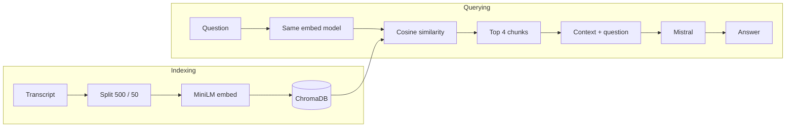

# AI Meeting Assistant

Turn any meeting recording into a summary, action items, key decisions and a
searchable transcript you can ask questions about.

Give it a YouTube link or upload a recording. It downloads the audio,
transcribes it locally with Whisper, runs it through a set of LLM chains for
structured insight, indexes it into a vector store, and hands you a web UI where
you can read the results, chat with the transcript, and export everything as PDF
or TXT.

Hindi and Hinglish recordings are routed through a separate speech-to-text
pipeline that transcribes and translates to English in one pass.

---

## Why this exists

Nobody re-watches a one-hour meeting to find one decision. And a raw transcript
doesn't help either — an hour of speech is roughly 9,000 words. What you actually
need is the transcript **plus** structure **plus** search. That's what this
builds.

---

## Features

- **Any source** — YouTube, Vimeo, SoundCloud, direct media URLs, or a local
  file upload (mp3, m4a, wav, flac, mp4, mkv, mov, webm…)
- **Local transcription** — Whisper runs on your machine; audio never leaves it
- **Hindi / Hinglish support** — separate route built for code-switched speech
- **Structured output** — summary, action items with owners and deadlines, key
  decisions, open questions
- **Chat with your meeting** — RAG over the transcript, grounded so it says
  "I could not find this" instead of inventing an answer
- **Export** — PDF or TXT
- **Live progress** — per-chunk progress while transcription runs

---

## Architecture



Everything upstream converges on **one canonical format** — a mono 16 kHz WAV.
Whisper, the LLM chains and the vector store never learn whether the meeting came
from YouTube or a phone recording, which is what makes adding a new source a
one-branch change.

---

## Request lifecycle

Transcribing an hour-long meeting takes minutes, so a POST starts a background
job and returns immediately. The browser polls for progress rather than holding
a connection open.



The transcript is written to disk **before** any LLM call, so an API failure
costs five cheap requests rather than the expensive transcription.

---

## RAG pipeline



Two chunk sizes are used deliberately, because the tasks want opposite things:

| Task | Chunk | Overlap | Why |
|---|---|---|---|
| Summarisation | 3,000 chars | 200 | Large chunks give the model enough context to summarise a section |
| Retrieval | 500 chars | 50 | Small chunks make each vector sharp, so search is precise |

---

## Getting started

### Prerequisites

**ffmpeg is required** and is not a Python package — install it separately:

```bash
# Windows
winget install Gyan.FFmpeg

# macOS
brew install ffmpeg

# Debian / Ubuntu
sudo apt install ffmpeg
```

On Windows, restart your terminal **and your editor** afterwards — VS Code caches
the old PATH, so a new terminal tab alone is not enough.

### Install

```bash
git clone https://github.com/Akshay-professor/AI-Video-Assistant-RAG.git
cd AI-Video-Assistant-RAG

python -m venv .venv
.venv\Scripts\activate          # Windows
source .venv/bin/activate       # macOS / Linux

pip install -r requirements.txt
```

### Configure

```bash
cp .env.example .env
```

Then edit `.env` and add your keys:

| Variable | Required | Purpose |
|---|---|---|
| `MISTRAL_API_KEY` | Yes | Summarisation, extraction, RAG answers |
| `WHISPER_MODEL` | No | Model size, defaults to `small` |
| `SARVAM_API_KEY` | Only for Hinglish | Hindi/Hinglish speech-to-text-translate |

### Run

**Web UI:**

```bash
python server.py
```

Open http://127.0.0.1:8000

**Command line:**

```bash
python main.py
```

---

## Project structure

```
├── server.py                 FastAPI backend, job queue, exports
├── main.py                   CLI entry point
├── web/
│   ├── index.html            Single-page UI
│   ├── styles.css            Light / dark theming
│   └── app.js                Polling, chat, drag-and-drop
├── core/
│   ├── transcriber.py        Whisper + Sarvam routing
│   ├── summarizer.py         Map-reduce summary, title
│   ├── extractor.py          Action items, decisions, questions
│   ├── vector_store.py       Chunking, embeddings, ChromaDB
│   └── rag_engine.py         Retrieval + grounded answer chain
└── utils/
    └── audio_processor.py    Download, normalise, chunk, uploads
```

---

## Tech stack

| Layer | Choice | Why |
|---|---|---|
| Audio download | yt-dlp | Supports ~1800 sites, not just YouTube |
| Audio processing | ffmpeg + pydub | Reads any format; converts once to the target shape |
| Transcription | OpenAI Whisper (local) | Free, private, no per-minute API cost |
| Hinglish STT | Sarvam AI | Built for Indian languages and code-switched speech |
| LLM | Mistral (`mistral-small-latest`) | Good enough for summarisation and extraction, usable free tier |
| Orchestration | LangChain LCEL | Composable chains; recursive text splitting |
| Embeddings | all-MiniLM-L6-v2 | Runs locally, 384-dim, free and fast on CPU |
| Vector store | ChromaDB | Persists to a directory, no server to run |
| Backend | FastAPI + uvicorn | Async, explicit job model, no re-run semantics |
| Frontend | Vanilla HTML/CSS/JS | No build step, no framework, three files |
| PDF export | ReportLab | Server-side PDF generation |

---

## Design notes

**Why mono 16 kHz?** Whisper resamples to mono 16 kHz internally regardless of
input. Converting once up front means a two-hour meeting is ~230 MB instead of
~1.4 GB, and pydub loads the whole file into memory to chunk it.

**Why chunk the audio?** Memory, progress reporting, and failure isolation — a
failed chunk can be retried without redoing the whole meeting.

**Why a job queue instead of a blocking request?** A multi-minute HTTP request
dies to browser and proxy timeouts, and shows the user nothing while it runs.

**Why format fallback on download?** YouTube intermittently refuses individual
format URLs with HTTP 403 while other formats on the same video download fine.
The downloader tries `bestaudio` first and steps down through alternatives. The
low-bitrate fallbacks cost almost nothing here, since everything is downmixed to
mono 16 kHz anyway.

**Why local embeddings?** Embedding is the highest-volume operation in the
system. Running MiniLM locally makes it free, removes a network round trip per
chunk, and keeps meeting content on the machine.

---

## Known limitations

Being honest about what this does not do yet:

- **One shared vector collection.** Every meeting is indexed into the same
  ChromaDB collection, so retrieval can return chunks from a previous meeting.
  Collection-per-meeting is the fix.
- **No evaluation suite.** Quality is verified by spot-checking, not by measured
  word error rate, retrieval recall or faithfulness.
- **Stateless chat.** Each question is independent, so follow-ups that rely on
  pronouns ("what's *their* deadline?") won't resolve.
- **Extraction returns prose.** Action items come back as formatted text rather
  than structured data, so they can't be sorted, filtered or pushed to a tracker.
- **Jobs are in memory.** Restarting the server loses the results list, though
  transcripts persist on disk.
- **Single user, no auth.** The server binds to `127.0.0.1` deliberately. It
  should not be exposed to a network without adding authentication.

---

## Roadmap

- [ ] Per-meeting vector collections
- [ ] Evaluation set with WER, recall@k and faithfulness metrics
- [ ] Structured output via Pydantic schemas
- [ ] Conversational memory with query rewriting
- [ ] Speaker diarisation
- [ ] Persistent job storage

---

## License

MIT
